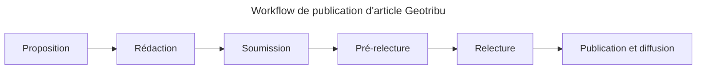

# Proposer un article

{: .img-thumbnail-left }

La rédaction d'articles est ouverte à toute personne souhaitant partager une expérience, l'histoire de la conception d'une carte, une méthodologie, un outil, un tutoriel, un billet d'humeur ou autre tant qu'il ne s'agit pas d'une publicité ou d'un communiqué ou contenu assimilable.

Gardez en tête que le travail de l'équipe est **bénévole**. A ce titre, plus votre contenu est conforme à nos prérequis et aux guides de contribution, moins il ne demande de travail de notre part. Ce que vous ne faites pas, nous devrons le faire.

Bref, appliquons le principe du *fair-use* au bénévolat :hugging: !

## Rédiger

{: .img-thumbnail-left }

Allez, cette fois, c'est parti ! L'angoisse de la feuille blanche n'a qu'à bien se tenir, vous êtes prêt/e à coucher votre prose !

Comme indiqué dans [les prérequis](../requirements.md), qu'importe le flacon, tant qu'on a l'ivresse de la rédaction  en Markdown : du simple éditeur de texte (oui, même le bloc-notes de Windows !) à l'éditeur lourd (à ce propos voir [le dossier de Next INpact](https://www.nextinpact.com/article/44240/zettlr-prise-en-main-dun-editeur-texte-aux-nombreuses-qualites)), faites votre choix !  
Mais sachez que nous mettons un éditeur collaboratif ([Hedgedoc](https://hedgedoc.org/)) à disposition des contributeur/ices sur simple demande.

<!-- [Utiliser le PAD :fontawesome-solid-feather-pointed:](http://pad.geotribu.fr/){: .md-button }
{: align=middle } -->

Sinon, cela tient en quelques étapes :

1. Créer un fichier Markdown (extension `.md` ou `markdown`)
2. Copier/coller le modèle d'article dans votre fichier [depuis Github](https://github.com/geotribu/website/blob/master/content/articles/templates/template_article.md?plain=1)
3. Remplir les parties !
4. Faire relire

:guide_dog: Lire et s'appuyer sur les guides de rédaction :

- [bases du Markdown](../guides/markdown_basics.md) et spécificités de l'implémentation utilisée sur le site
- insérer des medias :
    - [images](../guides/image.md)
    - des [vidéos](../guides/video.md)
    - des [émojis](../guides/emoji.md)
    - des [diagrammes (schémas)](../guides/diagrams.md)
    - des [tweets](../guides/twitter.md)
- gérer les [métadonnées](../guides/metadata_yaml_frontmatter.md)
- [signer son article](../guides/authoring.md)
- [choisir une licence](../guides/licensing.md)

Problème ? Souci ? Angoisse ? Simple question ?

[Contacter l'équipe pour échanger :fontawesome-regular-paper-plane:](mailto:geotribu+article@gmail.com){: .md-button }
{: align=middle }

----

## Soumettre

{: .img-thumbnail-left }

Une fois le contenu prêt, il ne reste plus qu'à pousser le contenu sur le [dépôt GitHub]. La procédure est différente selon si vous des droits en écriture ou non sur le [dépôt GitHub]. Ces droits sont généralement réservés aux contributeur/ices régulier/ères et aux membres de l'équipe.

### Je n'ai pas accès en écriture

Si vous n'avez pas l'habitude des plateformes basées sur [Git], sachez qu'il va vous falloir :

1. Créer un dépôt dérivé (*fork*) sur votre compte GitHub à partir du [dépôt GitHub] original de Geotribu :

    [Forker le dépôt GitHub :fontawesome-solid-code-branch:](https://github.com/geotribu/website/fork/){: .md-button }
    {: align=middle }

    {: .img-center loading=lazy }

    !!!tip "Déjà forké auparavant ?"
        A noter que si vous aviez déjà forké notre dépôt auparavant, il vous suffit de mettre à jour le dépôt dérivé sur votre compte via le bouton `Fetch Upstream` :  
        "){: .img-center loading=lazy }

2. Ajouter votre article dans votre dépôt dérivé :
    - soit via [Git] (ou un outil l'utilisant) si vous ça vous parle,
    - soit directement depuis l'interface web de GitHub en cliquant sur `Add file` :

    {: loading=lazy }
    {: align=middle }

3. Nommer le fichier selon la convention de nommage `content/articles/YYYY/YYYY-MM-DD_XXXXXX` où :
    - `YYYY` est l'année de publication
    - `MM` le mois de publication prévisionelle
    - `DD` le jour de publication prévisionnelle
    - `XXXXXX` le nom de l'article sans les caractères spéciaux ou les mots superflus (prépositions...)

    !!!tip
        Penser à s'inspirer des [articles déjà publiés](https://github.com/geotribu/website/tree/master/content/articles/2021) :wink: !  
        La date de publication pourra être amenée à changer selon les autres contenus planifiés.

4. S'il n'existe pas encore, créer un fichier avec une brève description de l'auteur/rice dans `content/team/prenom-nom.md`, puis intégrer ce bloc [en suivant le guide adéquat](../guides/authoring.md#bloc-auteur)

5. Créer la Pull Request[^pr] directement depuis votre dépôt dérivé via le bouton `Contribute` :

    {: loading=lazy }

6. Adapter la description de la Pull Request en indiquant rapidement le sujet et la motivation de l'article :

    {: .img-center loading=lazy }

### J'ai accès en écriture

1. Créer une branche en respectant la convention de nommage suivante `article/XXXXXX` où `XXXXXX` est nom de l'article en minuscules et sans caractère spécial

    {: .img-center loading=lazy }

2. Créer un fichier selon la convention de nommage `content/articles/YYYY/YYYY-MM-DD_XXXXXX` où :
    - `YYYY` est l'année de publication
    - `MM` le mois de publication prévisionelle
    - `DD` le jour de publication prévisionnelle
    - `XXXXXX` le nom de l'article sans les caractères spéciaux ou les mots superflus (prépositions...)

    !!!tip
        Penser à s'inspirer des [articles déjà publiés](https://github.com/geotribu/website/tree/master/content/articles/2021) :wink: !  
        La date de publication pourra être amenée à changer selon les autres contenus planifiés.

    {: .img-right loading=lazy }

3. S'il n'existe pas encore, créer un fichier avec une brève description de l'auteur/rice dans `content/team/prenom-nom.md`, puis intégrer ce bloc [en suivant le guide adéquat](../guides/authoring.md/#bloc-auteur)

4. [Créer la Pull Request](https://github.com/geotribu/website/compare)[^pr] en choisissant la branche de l'article comme source (`head`) et la branche principale (`master` ou `main`) comme destination (`ref`).

5. Adapter la description de la Pull Request en indiquant rapidement le sujet et la motivation de l'article

    {: .img-center loading=lazy }

6. Demander la relecture sur Slack, dans [le canal `Articles`](https://geotribu.slack.com/archives/C0165UARRBQ)

----

## Publication et diffusion

> Voir [la page dédiée](./publish.md).

<!-- Hyperlinks reference -->
[dépôt GitHub]: https://github.com/geotribu/website
[Git]: https://fr.wikipedia.org/wiki/Git
