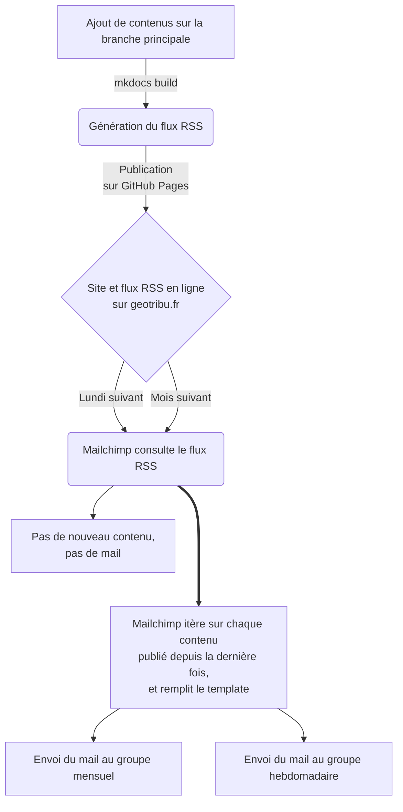

# Lettre d'informations automatisée

{: .img-thumbnail-left loading=lazy }

En complément des autres modes de diffusion (réseaux sociaux notamment), la lettre d'informations par mail, ou plus simplement _newsletter_, reste un moyen très apprécié pour faire de la veille et pour suivre l'actualité d'un site. De plus, la revue de presse de Geotribu peut être considérée comme une forme de newsletter et correspond donc très bien à ce format de diffusion.

Pour ne pas disperser l'énergie nécessaire à l'effort éditorial de rédaction, relecture et publication des contenus, l'idée est d'automatiser l'envoi des mails au maximum. Et tant pis pour le contenu original marketing !

C'est pour cette raison que l'on a opté pour Mailchimp, plateforme certes propriétaire mais l'une des rares à proposer cette fonctionnalité sans exiger davantage de maintenance ou travail.

Différents éléments sont mis en place :

- le flux RSS (via le [plugin dédié pour Mkdocs](https://github.com/Guts/mkdocs-rss-plugin)) est un prérequis
- le formulaire d'inscription à la newsletter
- les groupes de contacts selon l'option de fréquence
- le modèle de mail qui gère la syntaxe de remplacement à partir du RSS
- les campagnes d'envoi

----

## Fonctionnement

La newsletter utilise en fait le flux RSS pour remplir automatiquement les contenus publiés depuis l'envoi précédent. Voici le déroulé global depuis la publication d'un (ou plusieurs) nouveau(x) contenu(s) sur le site et l'envoi des mails :



----

## Modèle de mail et syntaxe de remplacement

{: .img-center loading=lazy }

Voici à quoi ressemble le modèle Mailchimp avec les balises de remplacement des valeurs issues du flux RSS :

```html
*|RSSITEMS:|*
*|RSSITEM:TITLE|*
Publié le *|RSSITEM:DATE:d/m/Y|* par *|RSSITEM:AUTHOR|*

🏷 Mots-clés : *|RSSITEM:CATEGORIES|*

Illustration - *|RSSITEM:TITLE|*

<a href="*|RSSITEM:URL|*"></a>
<br />

*|RSSITEM:CONTENT_FULL|*

Continuer la lecture » - Commenter » - Partager : *|RSSITEM:SHARE:Facebook,LinkedIn,Reddit,Twitter|*
*|END:RSSITEMS|*

Les autres contenus récents :
*|RSS:RECENT|*
```

----

## Fréquences de réception

Afin de proposer différentes fréquences de réception que l'abonné peut choisir, il faut créer [un groupe dans l'administration des contacts sur Mailchimp](https://us5.admin.mailchimp.com/lists/dashboard/groups?id=491210) de type radio (c'est-à-dire choix exclusif) :

{: .img-center loading=lazy }

Puis, il faut créer une campagne par option de fréquence. A date, nous en proposons deux :

{: .img-center loading=lazy }

----

## Ressources

- la [documentation officielle de Mailchimp sur la syntaxe RSS](https://mailchimp.com/fr/help/rss-merge-tags/)
